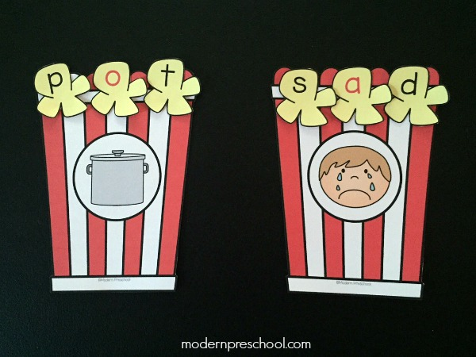

# **Bag of Words Meets Bags of Popcorn**

A natural language processing contest whose challenge was to predict IMDB movie sentiment from multi-paragraph movie reviews.

Here are [Notebook](http://nbviewer.ipython.org/gist/tranlyvu/bc2ea679ba0a98ec26c5) and [source code](https://github.com/tranlyvu/kaggle/tree/master/Bag%20of%20Words%20Meets%20Bags%20of%20Popcorn/main) describing my atempts in tackling the contest.

	
---
Contest Information
---

*  [Description](https://www.kaggle.com/c/word2vec-nlp-tutorial)
*  [Evaluation](https://www.kaggle.com/c/word2vec-nlp-tutorial/details/evaluation) 
*  [Data](https://www.kaggle.com/c/word2vec-nlp-tutorial/data)
