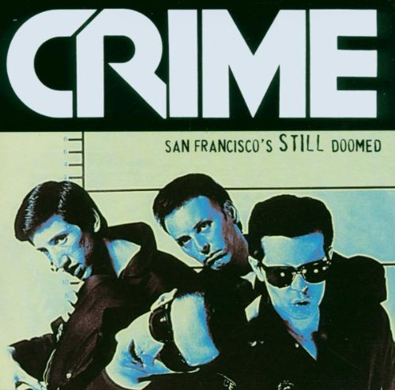

# **San Francisco Crime Classification**

A classification contest whose challenge was to Predict the category of crimes that occurred in San Francisco.

Here are Notebook and [source code](https://github.com/tranlyvu/kaggle/tree/master/San%20Francisco%20Crime%20Classification/main) describing my atempts in tackling the contest.  
	

---
Contest Information
---

*  [Description](https://www.kaggle.com/c/sf-crime)
*  [Evaluation](https://www.kaggle.com/c/sf-crime/details/evaluation)
*  [Data](https://www.kaggle.com/c/sf-crime/data)
